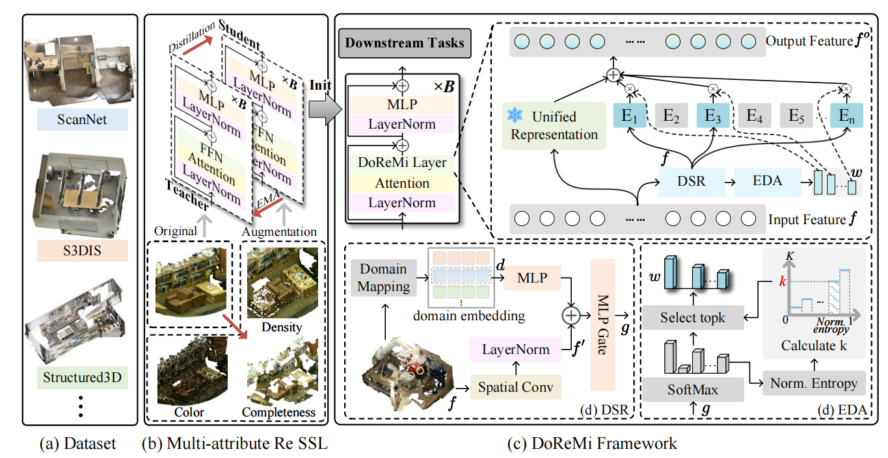

# DoReMi: Bridging 3D Domains via Topology-Aware Domain-Representation Mixture of Experts

 
[](https://xmw666.github.io/doremi_proj/)
[](https://arxiv.org/abs/2511.11232)
[](https://huggingface.co/koun123/DoReMi/tree/main)

This repository contains the official open-source implementation of **DoReMi**, built on top of Pointcept for generalizable 3D scene understanding.

If you find this project helpful, please consider giving us a star on GitHub ⭐️✨

## News

1. We released our arXiv paper: [https://arxiv.org/abs/2511.11232](https://arxiv.org/abs/2511.11232)
2. We released the ScanNet pretrained model weights and inference code.




## Installation

Please follow the official Pointcept installation guide:  
[https://github.com/Pointcept/Pointcept?tab=readme-ov-file#installation](https://github.com/Pointcept/Pointcept?tab=readme-ov-file#installation)

## Data Preparation (ScanNet)

For ScanNet preprocessing, please refer to:  
[https://github.com/Pointcept/Pointcept?tab=readme-ov-file#scannet-v2](https://github.com/Pointcept/Pointcept?tab=readme-ov-file#scannet-v2)

Pointcept preprocessed ScanNet dataset can be downloaded [here](https://huggingface.co/datasets/Pointcept/scannet-compressed); please agree to the official license before downloading it.

## Inference

### ScanNet

1. Download the pretrained checkpoint from [Hugging Face (koun123/DoReMi)](https://huggingface.co/koun123/DoReMi/tree/main) and place it under:
   `exp/scannet/doremi_ft/model/`
2. Run inference:

```bash
bash infer.sh
```

## Citation

If you find this work useful for your research, please cite:

```bibtex
@article{doremi2025,
  title   = {DoReMi: A Domain-Representation Mixture Framework for Generalizable 3D Understanding},
  journal = {arXiv preprint arXiv:2511.11232},
  year    = {2025},
  url     = {https://arxiv.org/abs/2511.11232}
}
```

## Acknowledgement

This project is built upon [Pointcept](https://github.com/Pointcept/Pointcept).  
We sincerely thank the authors and contributors of Pointcept for their excellent open-source work.

